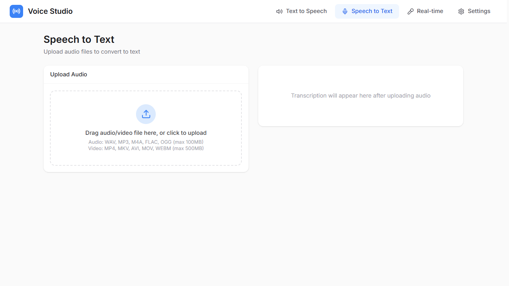
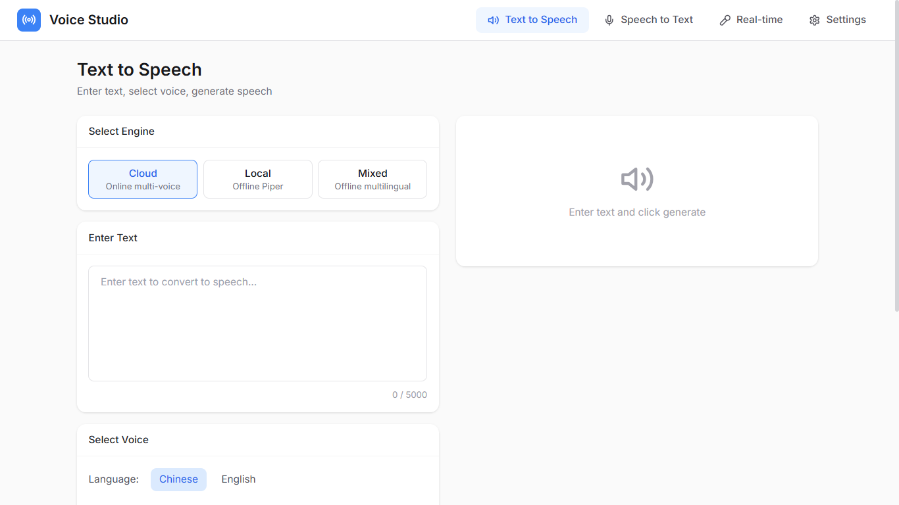
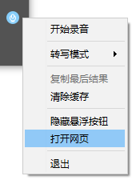

# Voice Studio

[中文](README.md) | English | [日本語](README_JA.md)

Making voice creation accessible - A lightweight, flexible, and extensible voice processing toolkit

## Preview

<p align="center">
  
</p>
<p align="center">
  
</p>

<p align="center">
  
  
</p>

## Features

- **Web UI**: Modern, minimalist web interface, ready to use out of the box
- **STT (Speech-to-Text)**: Based on faster-whisper, supports Chinese-English mixed recognition with word-level timestamps
  - Export to TXT, SRT, JSON formats
- **TTS (Text-to-Speech)**:
  - **Cloud**: Based on edge-tts, high-quality multi-voice synthesis
  - **Local**: Based on Piper TTS, offline capable, CPU optimized
  - **Chinese-English Mixed**: Based on ONNX models, supports seamless Chinese-English mixed synthesis, automatic long text processing
- **Floating Mic**: Desktop floating window, one-click speech-to-text, system tray support, auto-copy to clipboard
  - **Real-time Streaming**: Transcribe while speaking, instant results
  - **Batch Mode**: Transcribe after recording completes (default mode)
- **REST API**: FastAPI backend service, easy to integrate
- **CLI Tool**: Quick command-line access with process management

## Installation

```bash
# Install Python dependencies
pip install -e .

# Install Web UI dependencies
cd web && npm install
```

> **Tip**: After installation, use the `vs` command. If the command is not found, you can use `python -m voice_studio.cli` instead, for example:
> ```bash
> python -m voice_studio.cli serve
> ```
> Or ensure the Python Scripts directory is in your PATH environment variable.

## Quick Start

### Web UI

```bash
# Start backend service
vs serve

# Start frontend dev server (another terminal)
cd web && npm run dev

# Visit http://localhost:2345
```

### CLI Usage

```bash
# ========== Speech-to-Text ==========

# File transcription
vs stt -i recording.mp3 -o result.json

# ========== Text-to-Speech ==========

# Cloud TTS (default, requires internet)
vs tts -t "Hello, this is a test" -o output.mp3

# Local TTS (offline, auto-downloads model on first use)
vs tts -t "Hello, this is a test" -o output.wav --engine local

# Chinese-English Mixed TTS (seamless mixing, offline)
vs tts -t "Welcome to voice studio, it's a great tool" -o output.wav --engine mixed

# List available voices
vs voices

# Check local model status
vs voices --local

# ========== Service Management ==========

# Start dev server (frontend + backend)
vs dev

# Start dev server and open browser
vs dev --open

# Start backend/frontend only
vs dev --backend-only
vs dev --frontend-only

# Check service status
vs status

# Stop services
vs stop

# Restart services
vs restart

# View logs
vs logs              # Last 50 lines
vs logs --backend    # Backend logs only
vs logs -f           # Follow logs

# Start API server (backend only)
vs serve

# ========== Floating Mic ==========

# Launch floating mic (requires backend service running)
vs mic

# Floating mic supports two transcription modes:
# - Batch mode (default): Transcribe after recording
# - Real-time streaming: Transcribe while speaking
# Right-click tray icon → Transcription Mode → Select mode
```

### API Usage

After starting the service, visit http://localhost:8765/docs for interactive API documentation

#### STT Endpoint

```bash
# Upload audio file for transcription
curl -X POST "http://localhost:8765/api/v1/stt/transcribe" \
  -F "file=@test.mp3"
```

#### TTS Endpoints

```bash
# Cloud TTS (default)
curl -X POST "http://localhost:8765/api/v1/tts/synthesize?engine=cloud" \
  -H "Content-Type: application/json" \
  -d '{"text": "Hello World", "voice": "en-US-JennyNeural"}' \
  --output speech.mp3

# Local TTS (offline)
curl -X POST "http://localhost:8765/api/v1/tts/synthesize?engine=local" \
  -H "Content-Type: application/json" \
  -d '{"text": "Hello World", "voice": "en_US-lessac"}' \
  --output speech.wav

# Chinese-English Mixed TTS
curl -X POST "http://localhost:8765/api/v1/tts/synthesize-mixed" \
  -H "Content-Type: application/json" \
  -d '{"text": "Welcome to voice studio, it is a great tool", "length_scale": 1.0}' \
  --output speech_mixed.wav

# Get available voices
curl "http://localhost:8765/api/v1/tts/voices?engine=cloud&language=en"
curl "http://localhost:8765/api/v1/tts/voices?engine=local"
```

## Web UI Features

### Multi-language Support
Web UI supports Chinese, English, and Japanese interface:
- Auto-detect browser language
- Switch language in settings page
- Language preference auto-saved

### Speech-to-Text (STT)
- Drag & drop or click to upload audio files
- Support multiple formats (MP3, WAV, M4A, OGG, FLAC)
- Real-time transcription progress
- Word-level timestamps
- Export formats: TXT, SRT, JSON

### Text-to-Speech (TTS)
- Three engine modes: Cloud / Local / Mixed
- **Cloud Mode**: Multiple voices, speed and volume adjustment
- **Local Mode**: Piper TTS offline synthesis
- **Mixed Mode**:
  - Seamless Chinese-English input
  - Auto model download (first use)
  - Smart long text chunking
  - Speed adjustment (0.5x ~ 2.0x)
- Preview and download

## Preset Voices

### Cloud Voices (edge-tts)

#### Chinese Voices

| Name | Voice ID | Description |
|------|---------|-------------|
| xiaoxiao | zh-CN-XiaoxiaoNeural | Xiaoxiao - Female, natural |
| yunxi | zh-CN-YunxiNeural | Yunxi - Male, young |
| yunjian | zh-CN-YunjianNeural | Yunjian - Male, news anchor |
| xiaoyi | zh-CN-XiaoyiNeural | Xiaoyi - Female, gentle |

#### English Voices

| Name | Voice ID | Description |
|------|---------|-------------|
| jenny | en-US-JennyNeural | Jenny - Female, natural |
| guy | en-US-GuyNeural | Guy - Male, natural |
| aria | en-US-AriaNeural | Aria - Female, expressive |

### Local Voices (Piper TTS)

| Name | Voice ID | Language | Description |
|------|---------|----------|-------------|
| huayan | zh_CN-huayan | Chinese | Huayan - Female |
| lessac | en_US-lessac | English | Lessac - Female, natural |
| amy | en_US-amy | English | Amy - Female |

### Chinese-English Mixed TTS

Based on ONNX model for seamless Chinese-English synthesis:

| Feature | Description |
|---------|-------------|
| Mixed Input | Seamless switching, e.g., "Welcome to voice studio" |
| Fully Offline | No internet needed after model download |
| Unified Voice | Same voice for both languages, more natural |
| Long Text | Auto chunking with parallel synthesis |
| Speed Control | 0.5x ~ 2.0x adjustable |

> On first use, model auto-downloads from ModelScope to `~/.voicestudio/models/mixed_tts/` (~125MB)

> On first use of local engine, model auto-downloads to `~/.voicestudio/models/piper/`

## Configuration

Environment variables (prefix `VS_`):

```bash
# Server config
VS_HOST=127.0.0.1
VS_PORT=8765
VS_DEBUG=true

# STT config
VS_WHISPER_MODEL=base  # tiny/base/small/medium
VS_WHISPER_DEVICE=cpu

# TTS config
VS_DEFAULT_VOICE=en-US-JennyNeural
```

## Documentation

- [Architecture & Project Structure](docs/ARCHITECTURE.md) - Tech stack, architecture design, extension guide

## License

MIT